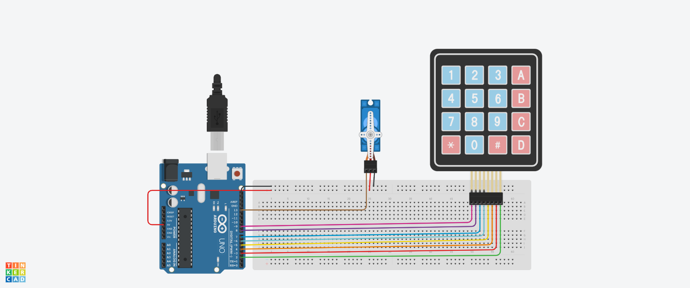

# 4x4 keypad doorlock system
## Description
In this project a simple 4x4 keypad door lock is which gives acess to only one 4-digit code.
## Components 
1. 4x4 keypad
2. Arduino board
3. Servo 
## working
Firstly the keypad inputs are mapped with the input pins in the arduino board.Now the input is read from the Keypad and the entered values are stored until "#" is pressed.When '#' is pressed the value is read and if the value is equal to given value(in my case '8955') the servo will rotate 90 degree wait for 5 second and then rotate back to zero.If the input code is wrong the servo will not rotate.
## Circuit

Link to tinkercad is [here](https://www.tinkercad.com/things/bI75nG48YmY-task32/editel?sharecode=7hhQ37Hm8jKQCFbFmHeURQ3PjoPOwGeXGteT_Wtt5uo)
